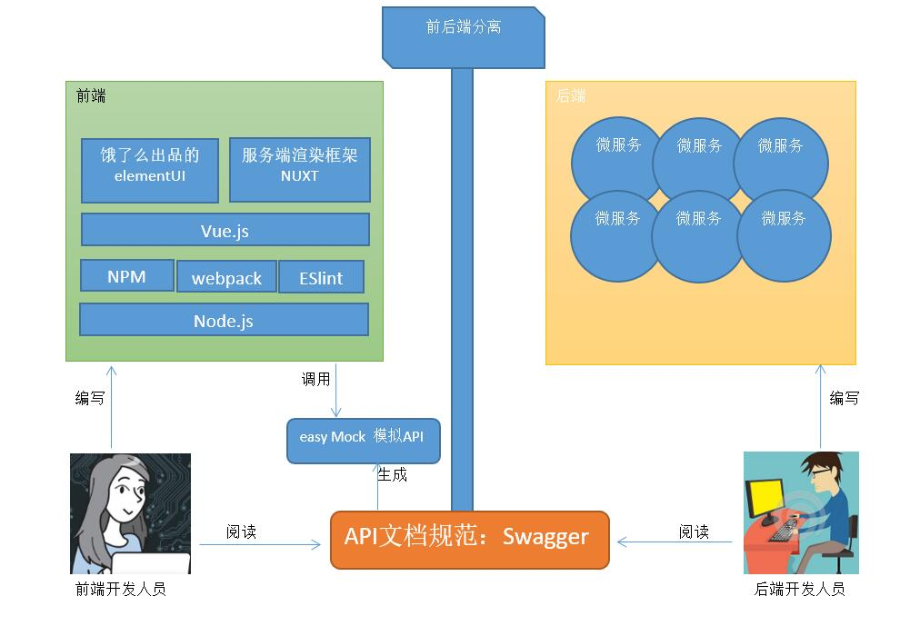

   
   
   

   
  
   

#### 一、项目介绍
《十次方社交系统》采用目前主流的微服务系统架构SpringBoot+SpringCloud+SpringData进行开发，前端技术采用Vue.js 。系统整体分为三大部分：微服务、网站前台、网站管理后台。功能模块包括文章、问答、招聘、活 动、吐槽、交友、用户中心、搜索中心及第三方登陆等。《十次方社交系统》项目融合了Docker容器化部署、第三方登陆、SpringBoot、SpringCloud、SpringData 、人工智能、爬虫、RabbitMQ等技术。

#### 二、项目架构

##### 1、技术架构

##### 2、功能架构

##### 3、分离架构

##### 4、智能推荐

##### 5、爬虫与智能分类

#### 三、项目截图

##### 1、项目首页

##### 2、后台管理页面

#### 四、项目模块

##### 1、后端模块
- tensquare-common 公共模块
- tensquare-article 文章微服务
- tensquare-base 基础微服务
- tensquare-friend 交友微服务
- tensquare-gathering 活动微服务
- tensquare-qa 问答微服务
- tensquare-recruit 招聘微服务
- tensquare-user 用户微服务
- tensquare-spit 吐槽微服务
- tensquare-search 搜索微服务
- tensquare-web-gateway 前台微服务网关
- tensquare-manager-gateway 后台微服务网关
- tensquare-eureka 注册中心
- tensquare-config 配置中心
- tensquare-sms 短信微服务
- tensquare-article-crawler 文章爬虫微服务
- tensquare-user-crawler 用户爬虫微服务
- tensquare-ai 人工智能微服务

##### 2、前端页面
- tensquare-portal  前端页面
- tensquare-manager 后台管理

##### 3、数据设计
- tensquare_article 文章
- tensquare_base 基础
- tensquare_friend 交友
- tensquare_gathering 活动
- tensquare_qa 问答
- tensquare_recruit 招聘
- tensquare_user 用户
- tensquare_spit 吐槽
